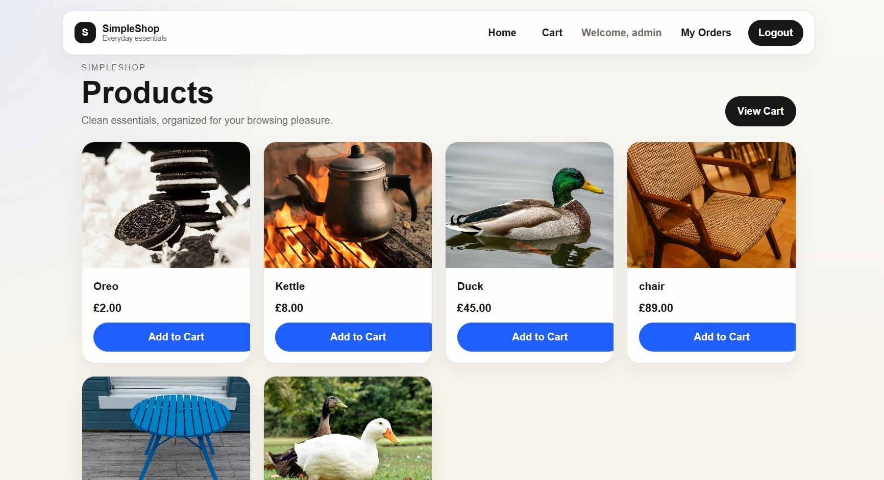
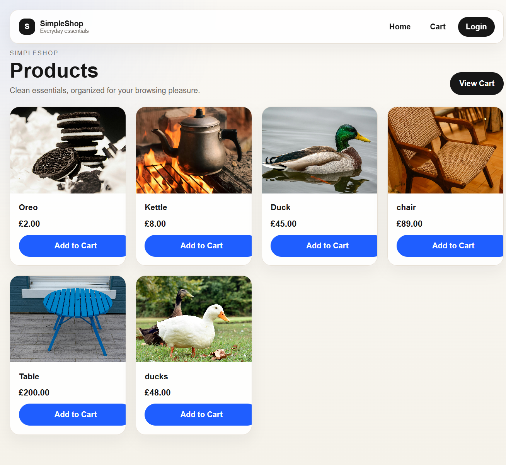
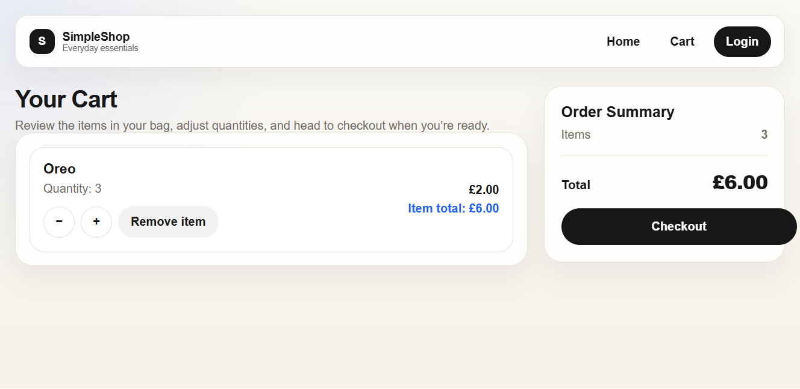
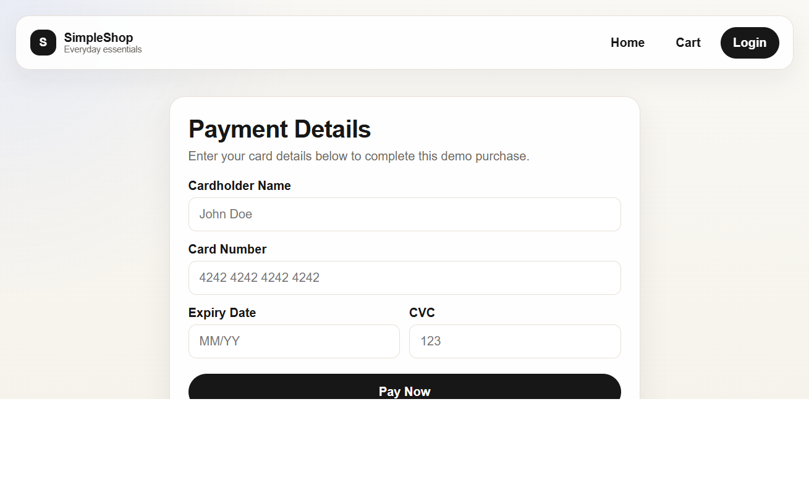

# SimpleShop – Django eCommerce App

	

## Overview
SimpleShop is a full-stack eCommerce web application built with Django, featuring a session-based cart system, multi-step checkout flow with simulated payment processing, and user-specific order history.

It goes beyond a basic product catalog by persisting cart state in the session, translating cart contents into orders, and supporting authenticated order history for returning users.

## Screenshots
<table>
	<tr>
		<td align="center" valign="top" width="33%">
			
			
<strong>Homepage</strong>

		</td>
		<td align="center" valign="top" width="33%">
			
			
<strong>Cart</strong>

		</td>
		<td align="center" valign="top" width="33%">
			
			
<strong>Checkout</strong>

		</td>
	</tr>
</table>

## Visit live version
https://simpleshop-80f5b8cdaaaa.herokuapp.com/

## Features
- Product listing and detail pages
- Session-based shopping cart
- Add, remove, and update item quantities
- Checkout flow with simulated payment system
- Order creation and order history
- User authentication (login/logout)
- Cloud-based image storage (Cloudinary)

## Tech Stack
- Python
- Django
- SQLite
- HTML/CSS
- Cloudinary

## How to Run
1. Clone the repo
2. Create virtual environment
3. Install requirements
4. Add environment variables (.env)
5. Run migrations
6. Start server

## What I Learned
- Building full-stack Django applications
- Managing session-based state (cart)
- Designing multi-step workflows (checkout & payment)
- Working with external services (Cloudinary)